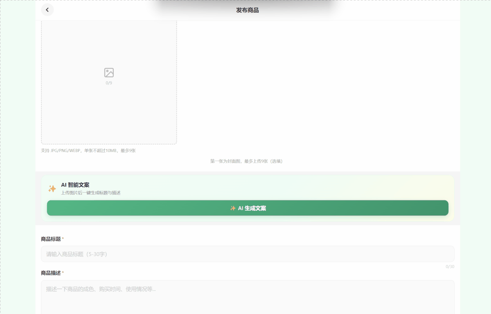
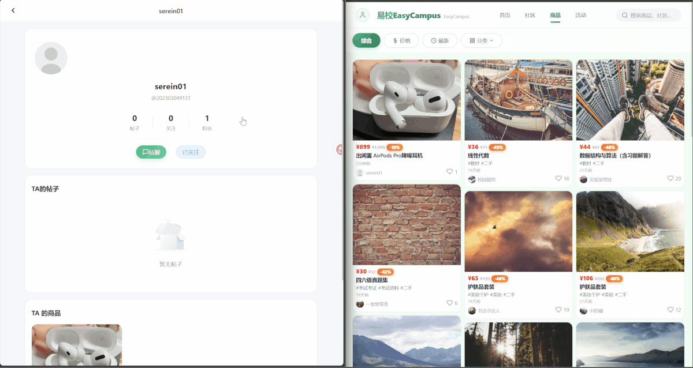
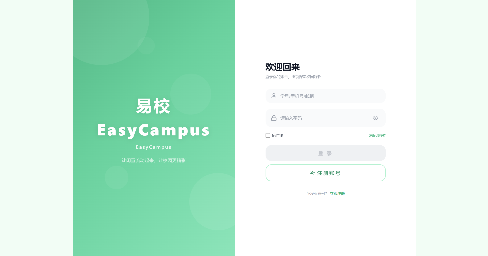
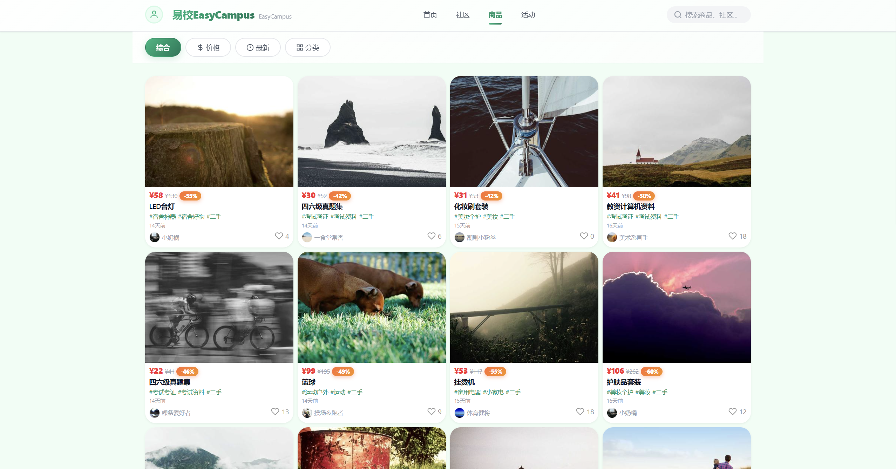
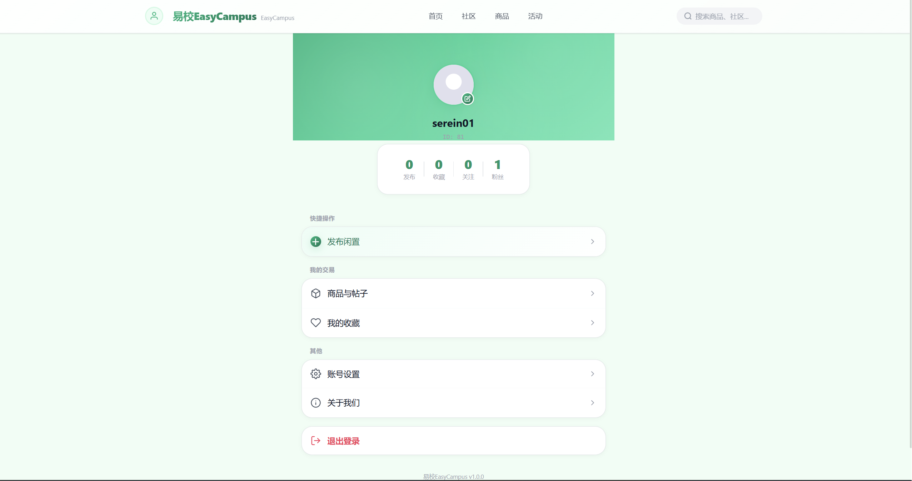
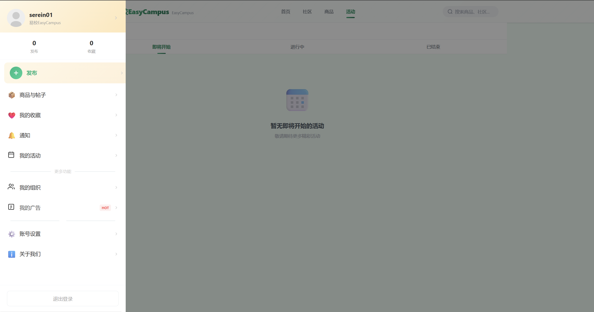

# EasyCampus 易校

> 面向校园场景的二手交易与社区平台：商品交易、图文社区、实时聊天、校园活动、组织管理、AI 发布助手，前后端分离全栈实现。

`Vue 3` · `TypeScript` · `Tailwind CSS 4` · `Pinia` · `Spring Boot 3` · `MySQL 8` · `WebSocket` · `DeepSeek AI` · `Docker`

---

## 功能总览

| 模块 | 说明 |
|------|------|
| 用户系统 | 注册登录、JWT 认证、邮箱验证码找回密码、个人资料、关注/粉丝 |
| 二手交易 | 商品发布、搜索筛选、分类浏览、收藏、点赞、评论、上下架管理、**AI 智能文案生成** |
| 社区帖子 | 图文发布、标签体系、点赞评论、信息流推荐 |
| 实时聊天 | WebSocket 点对点私信、在线状态、未读数提醒 |
| 经营数据看板 | 卖家视角 ECharts 可视化：发布/售出/成交额汇总、近 30 天浏览趋势、类目分布、浏览量 Top 商品 |
| 更多 | 校园活动报名、组织管理、全局搜索、通知中心、广告推流（模拟支付） |

## 技术亮点

- **JWT 无状态认证**：Spring Security 过滤器链 + Axios 请求/响应拦截器（自动携带 Token、401 统一处理）+ 前端路由守卫白名单
- **AI 商品文案助手**：DeepSeek 多模态视觉模型识别商品图片，SSE 流式输出标题与描述，前端打字机效果实时渲染；API Key 仅存服务端环境变量；请求支持 AbortController 取消与错误双通道反馈
- **SSE + Spring Security 兼容处理**：无状态 JWT 下 SseEmitter 异步派发会丢失登录态，通过 `requireExplicitSave(false)` 显式保存 SecurityContext，避免流式响应头提交后连接被掐断
- **实时通信**：WebSocket 心跳保活（25s）+ 指数退避自动重连，弱网环境不掉线
- **大文件分片上传**：超过 5MB 自动分片（2MB/片、3 并发）、进度回调、服务端合并
- **图片服务**：服务端 Thumbnailator 压缩缩放，限制最大分辨率与体积
- **安全防护**：BCrypt 密码散列、DOMPurify 净化富文本防 XSS、标签输入过滤
- **设计系统**：CSS 变量设计令牌，通过 Tailwind CSS 4 `@theme` 映射，原子类渐进替换 scoped CSS
- **数据可视化**：ECharts 按需引入 + 路由懒加载（不拖首屏），饼图/折线/柱状多类型图表，图表数据与服务端 SQL 聚合解耦（`GROUP BY` 类目/日期），点击图表联动查看明细
- **性能优化**：路由懒加载、vendor 分包、骨架屏、无限滚动、下拉刷新
- **工程化**：`vue-tsc` 类型检查构建、Knife4j 接口文档、Docker Compose 一键部署

## 技术栈

### 前端

| 类别 | 技术 |
|------|------|
| 核心框架 | Vue 3.4 —— Composition API、`<script setup>`、类型化 props/emits 组件通信、`provide/inject` 全局能力注入 |
| 开发语言 | TypeScript 5.4 —— API 响应接口建模、泛型封装请求层，`vue-tsc --noEmit` 构建期类型检查 |
| 构建工具 | Vite 5 —— 开发代理（`/api` → 8080）、多环境变量注入、`manualChunks` vendor 分包、路由组件动态 `import()` 懒加载 |
| 样式方案 | Tailwind CSS 4 —— `@tailwindcss/vite` 插件、`@theme` 映射 CSS 变量设计令牌（色板/阴影/动画曲线）、原子类渐进替换 scoped CSS |
| 路由 | Vue Router 4 —— History 模式、35 个路由全量懒加载、全局前置守卫 + 白名单鉴权、动态页面标题 |
| 状态管理 | Pinia（setup Store 写法）+ `pinia-plugin-persistedstate` 持久化 + 自定义 `splitStorage` 分键存储 token/user，规避 API 层与 Store 的循环依赖 |
| 网络层 | Axios —— 请求拦截器自动携带 JWT、响应拦截器统一错误与 401 处理、多环境 baseURL 策略（开发走 Vite 代理，生产同源 `/api`）；AI 文案采用原生 fetch + `ReadableStream` 解析 SSE，打字机效果实时回填 |
| 实时通信 | 原生 WebSocket 封装管理器 —— 心跳保活、指数退避重连、消息订阅分发 |
| 体验细节 | 骨架屏、无限滚动、下拉刷新、全局 Toast/确认弹窗、全屏图片查看器 |
| 工程化 | ESLint + Prettier 代码规范、DOMPurify 防 XSS、构建产物 gzip 压缩 |

### 后端

| 类别 | 技术 |
|------|------|
| 框架 | Spring Boot 3.3.5（Java 17）、Spring Security、MyBatis |
| 认证 | JJWT 0.11.5 无状态 Token + BCrypt 密码散列 |
| AI 服务 | DeepSeek 多模态视觉模型（OpenAI 兼容协议）+ JDK HttpClient 直连 + `SseEmitter` 流式透传，API Key 环境变量注入 |
| 实时通信 | spring-boot-starter-websocket（`/ws/chat` 端点） |
| 数据 | MySQL 8（21 张表）、Thumbnailator 图片压缩 |
| 文档 | Knife4j（OpenAPI 3）、Spring Boot Actuator 健康检查 |

### 部署

Docker Compose · Nginx 反向代理 · Railway / Render 配置文件

## 快速开始

环境要求：**JDK 17**、**Node.js 18+**、**MySQL 8**。详细步骤与常见问题见 **[本地部署运行指南.md](./本地部署运行指南.md)**。

```powershell
# 1. 配置数据库密码环境变量（Windows，设置后重开终端生效；Linux/macOS 用 export）
setx DB_PASSWORD "你的MySQL密码"

# 2. 启动后端（首次启动自动建库、建表并写入演示数据）
cd backend
./mvnw.cmd spring-boot:run "-Dspring-boot.run.profiles=dev,init"

# 3. 启动前端
cd frontend
npm install
npm run dev
```

| 入口 | 地址 |
|------|------|
| 前端页面 | http://localhost:3000 |
| 接口文档（Knife4j） | http://localhost:8080/doc.html |
| 演示账号 | `user01` / `123456`（另含 user02~user80 及配套商品、帖子、评论数据） |

> **看板演示数据（可选）**：以 user02 为展示卖家，为其灌入一批覆盖近 30 天、含已售出商品的种子数据，看"经营看板"效果更佳。在本地 MySQL 执行一次即可（幂等，可重复执行）：
> ```powershell
> mysql -uroot campus_market_dev < backend\src\main\resources\seed-dashboard-data.sql
> ```
> 执行后登录 `user02` / `123456` → 个人中心 → 经营看板，即可见真实聚合的可视化数据。

## 环境变量

| 变量 | 必填 | 说明 |
|------|:----:|------|
| `DB_PASSWORD` | ✅ | MySQL 密码（本地开发默认 root 账号，库名 `campus_market_dev` 自动创建） |
| `JWT_SECRET` | 建议 | JWT 签名密钥（生产环境必须配置强随机值） |
| `MAIL_USERNAME` / `MAIL_PASSWORD` | 可选 | SMTP 账号，用于邮箱验证码；未配置时仅该功能不可用，不影响其他功能 |
| `DEEPSEEK_API_KEY` | 可选 | DeepSeek API Key，用于「AI 商品文案助手」；去 [DeepSeek 开放平台](https://platform.deepseek.com) 申请（Windows 设置后需重开终端）；未配置时仅该功能不可用 |
| `DEEPSEEK_BASE_URL` / `DEEPSEEK_MODEL` | 可选 | AI 接口地址与模型（默认 `https://api.deepseek.com` / `deepseek-v4-flash-vision-exp`） |
| `SPRING_PROFILES_ACTIVE` | 可选 | 默认 `dev`；生产环境 `prod` 读取平台注入的数据库/邮件配置 |

## 项目结构

```
├── frontend/                    # 前端 Vue 3 + TypeScript
│   └── src/
│       ├── views/               # 35 个页面视图
│       ├── components/          # 14 个可复用组件
│       ├── services/api.ts      # Axios 实例 + 16 个 API 模块 + WebSocket 管理器
│       ├── store/               # Pinia 状态管理（auth / notification，setup Store + 持久化）
│       ├── router/              # 路由配置（懒加载 + 全局守卫）
│       ├── use/                 # 组合式函数（useToast / usePullRefresh）
│       └── assets/css/          # 设计系统（CSS 变量 + Tailwind @theme）
├── backend/                     # 后端 Spring Boot 3
│   └── src/main/java/com/campus/backend/
│       ├── controller/          # REST 接口层
│       ├── service/             # 业务逻辑层
│       ├── mapper/              # MyBatis 数据访问层
│       ├── entity / dto / vo    # 数据模型
│       └── config/              # Security / WebSocket / CORS 等配置
├── nginx/                       # Nginx 反向代理配置（生产）
├── Dockerfile                   # 后端镜像构建
├── docker-compose.prod.yml      # 生产编排（MySQL + 后端 + Nginx）
└── deploy.sh                    # 一键部署脚本
```

## 部署

```bash
# Docker Compose 一键部署（构建镜像 + MySQL + Nginx）
docker compose -f docker-compose.prod.yml up -d --build
```

敏感信息一律通过环境变量注入（`DB_PASSWORD`、`JWT_SECRET`、`MAIL_*`），仓库中不含任何真实密码、密钥与服务器地址。

---

前端 35 个页面 · 14 个组件 · 16 个 API 模块 ｜ 后端 21 张数据表 · RESTful API · WebSocket 实时通道

## 效果演示

### ✨ AI 智能文案助手（上传商品图片，流式生成标题与描述）


### ✨ 经营数据看板（可视化展示发布/售出/成交额汇总、近 30 天浏览趋势、类目分布、浏览量 Top 商品）


### 💬 实时 IM 聊天（WebSocket 心跳保活 + 断线自动重连）


### 核心页面
| 登录 | 商品列表 | 个人中心 | 设置 |
| ---- | -------- | -------- | ---- |
|  |  |  |  |

本项目用于学习交流，欢迎 Star 与 Issue。
